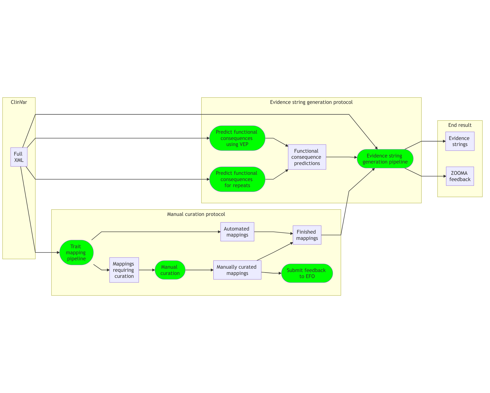

# How to submit an Open Targets batch
Batch submission process consists of two major tasks, which are performed asynchronously:
1. [**Manual curation**](docs/manual-curation/README.md) of trait names should be performed approximately once every two months as new ClinVar versions with new trait names are released. The output of this step is used by the main evidence string generation pipeline.
2. [**Evidence string generation**](docs/generate-evidence-strings.md) is mostly automated and should be run for every Open Targets batch submission.

Additional documentation:
* [Setting up the common environment](docs/environment.md) which is required by both protocols to be able to run
* [Advanced build instructions](docs/build.md), which are not required for batch processing under normal circumstances, because there is already an existing installation of the pipeline on the cluster. These instructions are necessary for the following cases:
  + Installing a newer Python version
  + Clean copying the repository and setting up the package installation from scratch
  + Running the pipeline in non-standard situations, for example when we need to use a version of OLS which has not yet been released
* [Evidence string comparison protocol](compare-evidence-strings/): when any significant updates to the code are done, an important control measure is re-running the latest batch using the same input data and the new code, and then doing the comparison to see if the introduced changes are correct.

# Background information

## ClinVar
[ClinVar](https://www.ncbi.nlm.nih.gov/clinvar/) is a curated database of clinically relevant genetic variation in humans, maintaned by the National Center for Biotechnology Information in the USA. For each variant, it stores a handful of information:
* **Variation location,** e. g.: *NM_007294.3(BRCA1):c.2706delA* (using [HGVS nomenclature](https://varnomen.hgvs.org/) in this example)
* **Gene** which the variant impacts: *BRCA1*
* **Condition** which is associated with this variant: *Hereditary breast and ovarian cancer syndrome*
* **Clinical significance** of the variant. It is most frequently evaluated using the [ACMG guidelines](https://www.acmg.net/docs/standards_guidelines_for_the_interpretation_of_sequence_variants.pdf); however, other approaches also exist. Most common values of this field are:
  * *Pathogenic* generally means that variation is causing the disease or making it worse
  * *Benign*: it has been established that the variant is *not* implicated in this disease
  * *Likely pathogenic* and *Likely benign* have the same meaning as “Pathogenic” and “Benign”, but signify that the connection isn't as certain (usually due to limited information being available for this variant)
  * *Uncertain significance* means that either there is contradictory information on the impact of this variant, or that information is insufficient to draw the conclusion
* **Review status** shows how many submitters provided information for this variant. Example values:
  + no assertion criteria
  + criteria provided, single submitter
  + criteria provided, multiple submitters, no conflicts

ClinVar is continuously updated and holds monthly releases of its database contents.

## OpenTargets
[OpenTargets](https://www.opentargets.org/) is a collaboration between academia and industry. Among other things, it combines associations between genetic variation and human traits (most notably, diseases) into a single integrated resource. This information is then used to provide evidence on the biological validity of therapeutic targets and an initial assessment of the likely effectiveness of pharmacological intervention on these targets.

OpenTargets also holds periodic releases, which happen approximately every two months. Data for every release comes from several data providers. There are several requirements for submitting data to OpenTargets:
* It must be represented in the form of “evidence strings”. These are JSON strings describing:
  + Genes the variant affects
  + Functional consequence of the variant on the gene
  + Traits (usually diseases) associated with the variant, such as “parkinson disease” or “age-related macular degeneration”.
  + Other information about the variant and source, such as related publications
* The variant data must be synchronised with a specific version of external data sources, for example Ensembl.

## Role of EVA
ClinVar data is highly valuable, but in its original form is not suitable for submission to OpenTargets. EVA is registered as one of the submitters for OpenTargets. For every OpenTargets release, the EVA processes ClinVar records (variants), curates the result and submits it to OpenTargets in the form of evidence strings. This allows for the up-to-date ClinVar data to be integrated into the OpenTargets platform.

Approximately one month before the submission deadline, OpenTargets will contact their submitters and specify the requirements for the next release. At this point the EVA can start executing the main submission protocol (see below). Once the data is ready, it is submitted to OpenTargets, and then the same will happen with the next release. Most of the actions in the pipeline are automated.

# Workflow diagram

See details [here](docs/workflow-diagram) about how to regenerate this diagram from source.

There is also a [presentation](https://docs.google.com/presentation/d/1nai1dvtfow4RkolyITcymXAsQqEwPJ8pUPcgjLDCntM) describing the workflow in more detail. However, it was last updated 1.5 years ago and part of it can be seriously obsolete.
